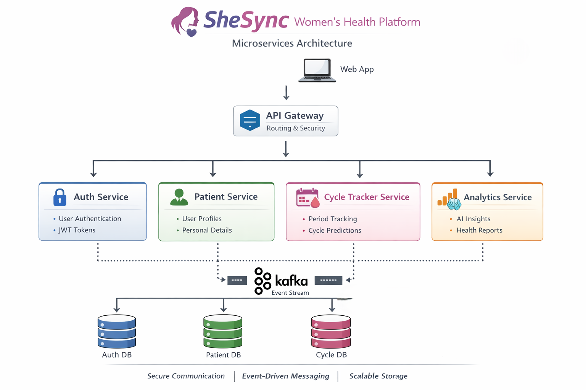

# 🌸 SheSync – Women's Health Microservices Backend

SheSync is a **microservices-based backend system** designed to support a **women's health and menstrual cycle tracking application**.

The platform enables users to **track menstrual cycles, monitor health indicators, and gain insights into their reproductive health**.

The backend architecture is built using **Spring Boot microservices, Kafka event streaming, API Gateway architecture, and Docker containerization** to ensure scalability, reliability, and modular development.

---

## 🚀 Features

- 📅 **Menstrual Cycle Tracking**
- 📊 **Health Insights & Monitoring**
- 🔐 **User Authentication and Authorization**
- 📩 **Notification System**
- 📡 **Event-driven communication using Kafka**
- ⚡ **Scalable Microservices Architecture**

---

## 🏗️ Architecture

The system follows a **microservices architecture** where each service handles a specific domain of the application.
cd SheSyncProject
<p align="center">
  
</p>

## 🧩 Microservices Overview

### 1️⃣ Auth Service

Handles **authentication and security** for the platform.

**Features:**
- User signup
- User login
- JWT token generation
- Credential validation
- Secure authentication workflow

This service ensures that only **authorized users can access protected APIs** within the system.

---

### 2️⃣ Patient Service

Manages **patient profile information** and stores user health-related metadata.

**Stores:**
- Name
- Email
- Address
- Date of Birth
- Registration Date

Each patient is assigned a **unique UUID**, which is used as the **primary identifier across all microservices** to maintain consistent data relationships.
### 3️⃣ Cycle Tracker Service

Responsible for **menstrual cycle tracking and prediction**.

This service records menstrual health data and generates predictions to help users better understand their cycle patterns.

**Tracks:**
- Last period date
- Cycle length
- Period duration
- Mood
- Stress level
- PCOS condition
- Cycle predictions

**Calculates:**
- Predicted next period
- Current cycle phase
- Cycle status *(Early / On-time / Delayed)*

---

## 🔄 Event Driven Communication

Services communicate **asynchronously using Apache Kafka**, enabling scalable and loosely coupled interactions between microservices.

### Example Events

| Event | Producer | Consumer |
|------|----------|----------|
| `USER_REGISTERED` | Patient Service | Cycle Tracker Service |
| `CYCLE_UPDATED` | Cycle Tracker Service | Notification / Content Services |
| `MOOD_LOGGED` | Cycle Tracker Service | Community Service |

This **event-driven architecture** ensures:

- Loose coupling between services
- High scalability
- Reliable asynchronous processing
- Better system resilience

## 🗄️ Database Design

Each microservice follows the **Database per Service pattern**, meaning every service manages its **own independent database**.  
This ensures **loose coupling, better scalability, and independent deployment of services**.

### Service Databases

| Service | Database |
|--------|--------|
| Auth Service | Auth DB |
| Patient Service | Patient DB |
| Cycle Tracker Service | Cycle DB |

---

### Example: Cycle Tracker Entity

The **Cycle Tracker Service** maintains records related to menstrual cycle tracking.
```json
{
cycleId,
patientId,
lastPeriodDate,
cycleLength,
periodLength,
mood,
stressed,
hasPCOS,
predictedNextPeriod,
cycleStatus
}
```

---

### 🔗 Data Communication Between Services

Since each microservice has its own database, **direct database joins between services are avoided**.

Instead, services communicate using the **`patientId` (UUID)** as a shared identifier.

This approach provides:

- **Service isolation**
- **Independent scaling**
- **Improved fault tolerance**
- **Better maintainability**

## 🛠️ Tech Stack

### Backend Framework
- **Spring Boot**

### Architecture
- **Microservices**
- **API Gateway Pattern**

### Messaging
- **Apache Kafka**
- **Zookeeper**

### Containerization
- **Docker**
- **Docker Compose**

### Database
- **SQL** (each service has its own database)

### Security
- **JWT Authentication**

### Build Tool
- **Maven**

## 🐳 Running the Project

### 1️⃣ Clone the Repository
```bash
git clone https://github.com/YOUR_USERNAME/shesync-backend.git
cd shesync-backend
```
### 2️⃣ Start the Containers
```bash
docker-compose up --build
```
This will start the following services:

1. API Gateway
2. Auth Service
3. Patient Service
4. Cycle Tracker Service
5. Kafka
6. Zookeeper
7. Databases

### 3️⃣ Access Services

You can access the services through the API Gateway. Example endpoints:

#### Auth Service
- `POST /auth/signup` – Register a new user
- `POST /auth/login` – User login and JWT token generation

#### Patient Service
- `GET /patients/profile` – Fetch patient profile information

#### Cycle Tracker Service
- `POST /cycles/onboarding` – Submit cycle information for a patient
- `GET /cycles/prediction` – Retrieve predicted cycle details

### 🔮 Cycle Prediction Logic

Cycle predictions are calculated using the formula:

**Predicted Next Period** = Last Period Date + Average Cycle Length

**Example:**

- Last Period Date: May 1  
- Cycle Length: 28 days  
- **Predicted Next Period:** May 29

The **cycle status** is determined by comparing the predicted date with the current date:

- Early
- On-time
- Delayed

### Containerized Deployment

All services are containerized using Docker and orchestrated with Docker Compose.

Example services:

1. API Gateway
2. Auth Service
3. Patient Service
4. Cycle Tracker Service
5. Kafka Broker
6. Zookeeper

This allows the system to run consistently across environments.

### 🔒 Security

Authentication is implemented using **JWT tokens**.

**Flow:**
User Login
↓
Auth Service validates credentials
↓
JWT Token issued
↓
Frontend sends token with each request
↓
API Gateway validates token

## Key Learning Outcomes

This project demonstrates:

1. Microservices architecture design
2. Event-driven communication
3. Secure authentication with JWT
4. Containerized deployments using Docker
5. Distributed system design principles

### Author

Developed by Bhumika Dash
